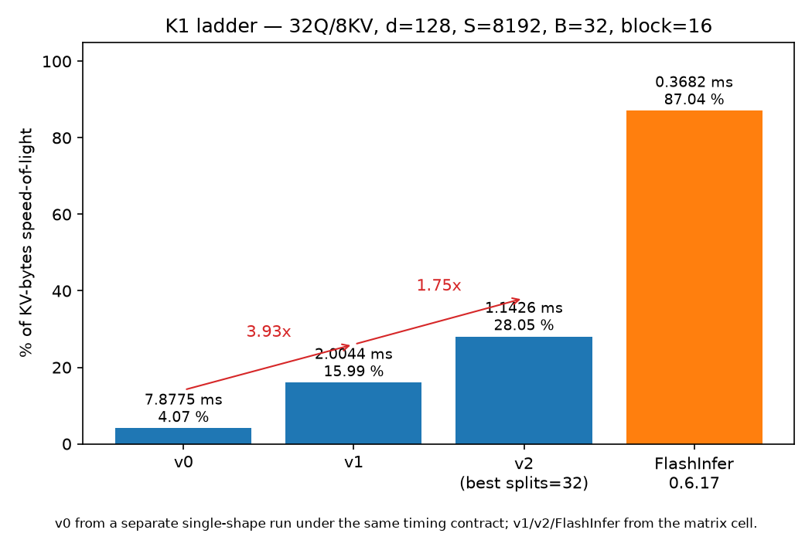
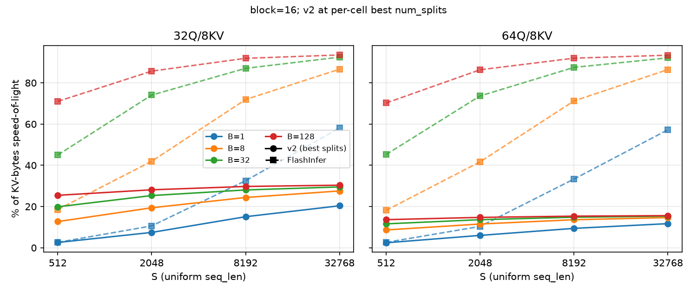
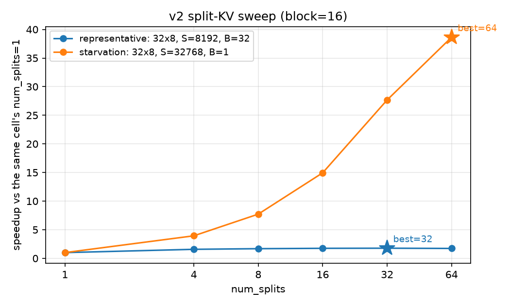

# mla-decode-kernels

Hand-written CUDA decode-attention kernels for paged KV cache on Hopper — GQA → MLA → DSA-style sparse — benchmarked per-shape against FlashInfer/FlashMLA with NCU-backed ablation analysis.

## Status

K1 (GQA paged decode) is complete: three kernel tiers (v0 → v1 → v2), a
64-cell benchmark matrix against FlashInfer, and an NCU ablation of every
ladder step, all measured 2026-08-24; compute-sanitizer runs archived
2026-08-26. Freeze gate: 2026-09-27. Next: K2, MLA absorbed-path paged
decode.

Analysis narrative: [docs/k1/notes_w1.md](docs/k1/notes_w1.md). Decision
records: [docs/decisions/](docs/decisions/).

## K1: GQA paged decode

Single-token decode attention over a paged KV cache, bf16, d=128.
Interface:

- `q [B, Hq, 128]` bf16 — one query token per request
- `k_cache`, `v_cache [num_blocks, block, Hkv, 128]` bf16, NHD layout
- `block_table [B, max_blocks]` int32 — physical block ids, arbitrary order
- `seq_lens [B]` int32
- `out [B, Hq, 128]` bf16
- GQA grouping: `kv_head = q_head // (Hq / Hkv)` — consecutive, matching
  Hugging Face `repeat_kv` semantics
  ([k1-002](docs/decisions/k1-002-gqa-grouping.md))

**v0 — naive.** One CTA per (batch, q-head) pair, 128 threads, thread j owns
head dimension j. A sequential online-softmax scan over the request's paged
KV: per token, a shared-memory tree reduction forms the dot product, then
the fp32 (m, l, acc) state is updated with the accurate `expf`. Its job is
to match the fp32 reference while being trivial to reason about
([k1-001](docs/decisions/k1-001-cta-mapping.md),
[k1-003](docs/decisions/k1-003-fp32-state-expf.md)).

**v1 — vectorized warp scan.** Warp-per-token strided scan: each of 4 warps
processes tokens `t = w, w+4, w+8, ...` with its own fp32 (m, l, acc) state,
loads K/V rows with 8 B vector loads (4 bf16 per lane), and reduces dot
products with warp shuffles. The four per-warp states are merged once after
the loop with the split-softmax identity — the loop body has no
`__syncthreads` ([k1-005](docs/decisions/k1-005-v1-design.md)).

**v2 — split-KV.** The sequence is cut into `num_splits` segments. A partial
kernel (one CTA per (q-head, batch, segment)) runs the v1 scan on its
segment and writes an fp32 (m, l, acc) partial state to a global workspace;
a merge kernel combines the segments with the online-softmax merge identity
and writes the bf16 output. `num_splits=1` is bitwise-identical to v1,
which closes the ablation chain
([k1-006](docs/decisions/k1-006-v2-splitkv.md)).

## Results

All numbers in this section are generated from archived result files by
`analysis/report/make_report.py`; each block names its sources. Prose
numbers not in a generated block are tagged (notes_w1.md), i.e.
[docs/k1/notes_w1.md](docs/k1/notes_w1.md). "% of SoL" is percent of
KV-bytes speed-of-light, defined in Methodology.

<!-- GEN:headline -->
- Representative shape (32Q/8KV, d=128, S=8192, B=32, block=16, 1 GiB of KV): v0 7.8775 ms (4.07 % of SoL) → v1 2.0044 ms (15.99 %) → v2 1.1426 ms (28.05 %, best num_splits=32); FlashInfer 0.3682 ms (87.04 %).
- Best v2 % of SoL over the 64-cell matrix: 30.42 % for 32Q/8KV (S=32768, B=128, block=64, num_splits=32) and 15.59 % for 64Q/8KV (S=32768, B=128, block=64, num_splits=32).
- v2 ratio_vs_flashinfer (FlashInfer median / v2 median; > 1 would mean faster than the baseline): 32Q/8KV 0.314 (32x8, S=32768, B=8, block=64) to 0.976 (32x8, S=512, B=1, block=16); 64Q/8KV 0.166 (64x8, S=32768, B=32, block=64) to 0.922 (64x8, S=512, B=1, block=16).

Source: bench/results/matrix_20260824_213534/ (cell JSONs), bench/results/v0_32x8192x32x8x16_20260824_192119.json
<!-- /GEN:headline -->

### The ladder, attributed



<!-- GEN:ladder_table -->
| kernel | median ms | % of SoL | speedup | DRAM % (NCU) | sectors/req | occupancy % | top-3 stalls (cyc/inst) |
|---|---|---|---|---|---|---|---|
| v0 (single-shape run) | 7.8775 | 4.07 | — | 3.65 | 1.67 | 47.51 | long_scoreboard=6.716, short_scoreboard=2.241, wait=1.987 |
| v1 | 2.0044 | 15.99 | 3.93x vs v0 | 14.55 | 5.67 | 47.54 | long_scoreboard=11.023, wait=1.912, short_scoreboard=1.211 |
| v2, splits=8 (default) | 1.1996 | 26.72 | 1.67x vs v1 | 22.96 | 5.66 | 89.64 | long_scoreboard=9.632, not_selected=3.206, wait=1.944 |
| v2, best splits=32 | 1.1426 | 28.05 | 1.75x vs v1 | — | — | — | — |
| FlashInfer 0.6.17 | 0.3682 | 87.04 | — | — | — | — | — |
NCU columns are from separate single-launch profiles at this shape (the v2 NCU row is num_splits=8, matching the profiled configuration). NCU replays a single cold launch while bench medians come from warmed runs, so compare trends within one tool, not absolutes across tools (notes_w1.md). v0 timing comes from a separate single-shape run under the same timing contract; v0 is not in the matrix at this shape.

Source: bench/results/matrix_20260824_213534/cell_32x8_S8192_B32_bs16.json, bench/results/v0_32x8192x32x8x16_20260824_192119.json, analysis/ncu/v0_rep.csv, analysis/ncu/v1_rep.csv, analysis/ncu/v2_rep.csv
<!-- /GEN:ladder_table -->

The causal reading (notes_w1.md): v0 → v1 is warp overlap, not faster
per-token work — v0's single serial scan spends 962 ns per token and each
of v1's four concurrent per-warp scans spends 979 ns per token, so the
speedup comes from running four dependency chains at once; DRAM traffic is
1x the KV size in both, with L2 absorbing the GQA q-heads' re-reads of the
shared kv-head. v1 → v2 is CTA supply: v1's grid is pinned at 256 CTAs
(0.48 waves) at this shape while v2 at splits=8 launches 8192 (~3.9 waves),
and achieved occupancy rises 47.5 → 89.6 % with the occupancy limiter
unchanged — the per-CTA ceiling never moved, the machine was simply
undersupplied. The `not_selected` stall entering v2's top-3 is consistent
with a surplus of runnable warps rather than exposed latency.

### The matrix vs FlashInfer



<!-- GEN:ratio_32x8 -->
v2 ratio_vs_flashinfer at block=16, 32Q/8KV — each cell is ratio (best num_splits):

| S \ B | 1 | 8 | 32 | 128 |
|---|---|---|---|---|
| 512 | 0.976 (16) | 0.685 (4) | 0.442 (8) | 0.358 (4) |
| 2048 | 0.702 (32) | 0.463 (8) | 0.342 (16) | 0.328 (8) |
| 8192 | 0.463 (32) | 0.339 (32) | 0.322 (32) | 0.324 (16) |
| 32768 | 0.351 (64) | 0.318 (64) | 0.319 (64) | 0.325 (32) |

FlashInfer % of SoL at block=16, 32Q/8KV:

| S \ B | 1 | 8 | 32 | 128 |
|---|---|---|---|---|
| 512 | 2.63 | 18.54 | 45.00 | 71.00 |
| 2048 | 10.60 | 41.96 | 74.06 | 85.68 |
| 8192 | 32.54 | 71.91 | 87.04 | 91.91 |
| 32768 | 58.07 | 86.64 | 92.46 | 93.52 |

Source: bench/results/matrix_20260824_213534/ (cell JSONs)
<!-- /GEN:ratio_32x8 -->

<!-- GEN:ratio_64x8 -->
v2 ratio_vs_flashinfer at block=16, 64Q/8KV — each cell is ratio (best num_splits):

| S \ B | 1 | 8 | 32 | 128 |
|---|---|---|---|---|
| 512 | 0.922 (16) | 0.476 (8) | 0.257 (4) | 0.194 (4) |
| 2048 | 0.580 (16) | 0.277 (16) | 0.185 (8) | 0.171 (4) |
| 8192 | 0.282 (32) | 0.191 (32) | 0.169 (16) | 0.167 (16) |
| 32768 | 0.204 (64) | 0.169 (64) | 0.166 (64) | 0.167 (32) |

FlashInfer % of SoL at block=16, 64Q/8KV:

| S \ B | 1 | 8 | 32 | 128 |
|---|---|---|---|---|
| 512 | 2.62 | 18.16 | 45.23 | 70.22 |
| 2048 | 10.35 | 41.68 | 73.65 | 86.34 |
| 8192 | 33.33 | 71.24 | 87.49 | 91.97 |
| 32768 | 57.25 | 86.43 | 92.12 | 93.41 |

Source: bench/results/matrix_20260824_213534/ (cell JSONs)
<!-- /GEN:ratio_64x8 -->

Two convergence walls (notes_w1.md): once both sides have enough work,
every saturated 32Q cell converges to a ratio of ~0.32 — FlashInfer a
steady ~3.1x faster — and every saturated 64Q cell to ~0.167, half the 32Q
value. The 32Q wall is an in-flight-bytes limit (see Limitations). The 64Q
halving is per-q-head L2 re-reads: doubling q-heads at fixed KV doubles the
on-chip traffic of our per-q-head scan while FlashInfer's tensor-core
batching makes the extra q-heads nearly free; the evidence is cell B in the
NCU table below — DRAM bytes stay flat while L2 hit rate rises and DRAM %
of peak halves.

<!-- GEN:v2_over_v1 -->
v2 speedup over v1 (v1 median / v2 best median) ranges from 0.983x (64x8, S=512, B=128, block=16) to 38.60x (32x8, S=32768, B=1, block=64).

Source: bench/results/matrix_20260824_213534/ (cell JSONs)
<!-- /GEN:v2_over_v1 -->

### num_splits: sweep and rollover



<!-- GEN:argbest -->
Best num_splits per cell (block=16):

32Q/8KV:

| S \ B | 1 | 8 | 32 | 128 |
|---|---|---|---|---|
| 512 | 16 | 4 | 8 | 4 |
| 2048 | 32 | 8 | 16 | 8 |
| 8192 | 32 | 32 | 32 | 16 |
| 32768 | 64 | 64 | 64 | 32 |

64Q/8KV:

| S \ B | 1 | 8 | 32 | 128 |
|---|---|---|---|---|
| 512 | 16 | 8 | 4 | 4 |
| 2048 | 16 | 16 | 8 | 4 |
| 8192 | 32 | 32 | 16 | 16 |
| 32768 | 64 | 64 | 64 | 32 |

Rollover check over these 32 block=16 cells: 26 cells have argbest < 64, and in 26 of those 26 splits=64 is strictly slower than argbest — the rollover the W1 notes deferred is observed. At the representative cell the sweep peaks at num_splits=32 (1.1426 ms) and 64 is slower (1.1703 ms).

Source: bench/results/matrix_20260824_213534/ (cell JSONs, by_splits)
<!-- /GEN:argbest -->

At the representative cell the sweep peaks at num_splits=32 and 64 is
slower — the rollover the W1 notes deferred is now observed. At the
starvation cell C the cost of splitting hard is visible on the other side:
the merge kernel is ~11 % of the partial-kernel time (GEN:ncu_cells below),
consistent with argbest stopping at 64.

### Block size and launch floor

<!-- GEN:block_effect -->
Across the 104 (cell, kernel) pairs present at both block sizes, the median |Δ| between the block=16 and block=64 medians is 0.49 % (Δ relative to the faster of the two). 8 pairs exceed 2 %, all of them B=1 cells; the worst is 30.7 % (32x8, S=8192, B=1, v1).

Source: bench/results/matrix_20260824_213534/ (cell JSONs)
<!-- /GEN:block_effect -->

Paging granularity is performance-neutral at these shapes; the pairs above
2 % are all B=1 cells, where a starved grid makes timing sensitive to
block-granularity effects rather than paging cost (notes_w1.md). Separately,
the near-tie at B=1, S=512 (ratio 0.976 in the 32x8 table above) is a
launch-overhead floor, not a bandwidth result: KV SoL there is ~2 µs
(notes_w1.md) and both sides sit on fixed launch/merge costs, so it carries
no bandwidth information.

### 3-cell NCU deep dive

<!-- GEN:ncu_cells -->
| cell | DRAM % | sectors/req | occupancy % | L2 hit % | DRAM bytes | L2 bytes | merge ms |
|---|---|---|---|---|---|---|---|
| A:32x8_S8192_B32_bs16_splits32 | 24.75 | 5.65 | 97.13 | 51.11 | 1.101e+09 | 3.811e+09 | 0.0150 |
| B:64x8_S8192_B32_bs16_splits16 | 12.71 | 5.66 | 97.23 | 65.80 | 1.105e+09 | 5.443e+09 | 0.0111 |
| C:32x8_S32768_B1_bs16_splits64 | 17.95 | 5.66 | 71.93 | 13.06 | 1.367e+08 | 2.318e+08 | 0.0249 |
Derived: DRAM bytes B/A = 1.004x; L2 (lts) bytes B/A = 1.43x; in C the merge kernel is 24.9 µs on a 227.1 µs partial (both NCU gpu__time_duration from the same profile), i.e. ~11 % of the partial-kernel time.

Source: analysis/ncu/matrix_cells.csv, analysis/ncu/cellC_rep_raw.csv
<!-- /GEN:ncu_cells -->

Hypothesis (B vs A) — the 64Q slowdown is per-q-head L2 re-reads, not DRAM
— confirmed: DRAM bytes are flat (B/A = 1.004x) while the partial kernel
takes 1.96x longer (notes_w1.md) and DRAM % of peak halves; L2 hit rate
rises 51.11 → 65.80 % exactly as re-reads concentrate. One sub-prediction
missed quantitatively: L2 (lts) bytes grew 1.43x, not ~2x. L1 does not
explain it (l1tex hit rate is ~7 % in both cells, notes_w1.md); a plausible
mechanism is L1 MSHR merging of concurrent same-sector misses from
co-resident CTAs of the same (b, hkv) group, which collapses duplicates
before they are counted as L2 requests — recorded as a hypothesis, not
verified.

### Full per-shape table

<!-- GEN:pershape -->
All block=16 cells (both headtypes). The block=64 table lives in [docs/k1/results_block64.md](docs/k1/results_block64.md). v0 was benchmarked only where it is not prohibitively slow (S ≤ 2048 and B ≤ 8).

| heads | S | B | KV bytes | SoL ms | FlashInfer ms / %SoL | v0 ms / %SoL | v1 ms / %SoL | v2 ms / %SoL / best splits | v2 ratio |
|---|---|---|---|---|---|---|---|---|---|
| 32x8 | 512 | 1 | 2 MiB | 0.0006 | 0.0238 / 2.63 | 0.2687 / 0.23 | 0.0732 / 0.86 | 0.0244 / 2.56 / 16 | 0.976 |
| 32x8 | 512 | 8 | 16 MiB | 0.0050 | 0.0270 / 18.54 | 0.2744 / 1.83 | 0.0750 / 6.68 | 0.0394 / 12.70 / 4 | 0.685 |
| 32x8 | 512 | 32 | 64 MiB | 0.0200 | 0.0445 / 45.00 | — | 0.1360 / 14.73 | 0.1008 / 19.88 / 8 | 0.442 |
| 32x8 | 512 | 128 | 256 MiB | 0.0801 | 0.1129 / 71.00 | — | 0.3182 / 25.18 | 0.3148 / 25.45 / 4 | 0.358 |
| 32x8 | 2048 | 1 | 8 MiB | 0.0025 | 0.0236 / 10.60 | 1.0477 / 0.24 | 0.2619 / 0.96 | 0.0336 / 7.45 / 32 | 0.702 |
| 32x8 | 2048 | 8 | 64 MiB | 0.0200 | 0.0477 / 41.96 | 1.9332 / 1.04 | 0.4940 / 4.05 | 0.1032 / 19.41 / 8 | 0.463 |
| 32x8 | 2048 | 32 | 256 MiB | 0.0801 | 0.1082 / 74.06 | — | 0.5115 / 15.67 | 0.3164 / 25.33 / 16 | 0.342 |
| 32x8 | 2048 | 128 | 1 GiB | 0.3205 | 0.3741 / 85.68 | — | 1.2475 / 25.69 | 1.1396 / 28.13 / 8 | 0.328 |
| 32x8 | 8192 | 1 | 32 MiB | 0.0100 | 0.0308 / 32.54 | — | 1.2721 / 0.79 | 0.0665 / 15.07 / 32 | 0.463 |
| 32x8 | 8192 | 8 | 256 MiB | 0.0801 | 0.1114 / 71.91 | — | 1.9309 / 4.15 | 0.3285 / 24.39 / 32 | 0.339 |
| 32x8 | 8192 | 32 | 1 GiB | 0.3205 | 0.3682 / 87.04 | — | 2.0044 / 15.99 | 1.1426 / 28.05 / 32 | 0.322 |
| 32x8 | 8192 | 128 | 4 GiB | 1.2821 | 1.3950 / 91.91 | — | 4.8989 / 26.17 | 4.3107 / 29.74 / 16 | 0.324 |
| 32x8 | 32768 | 1 | 128 MiB | 0.0401 | 0.0690 / 58.07 | — | 7.5833 / 0.53 | 0.1967 / 20.37 / 64 | 0.351 |
| 32x8 | 32768 | 8 | 1 GiB | 0.3205 | 0.3700 / 86.64 | — | 7.6523 / 4.19 | 1.1625 / 27.57 / 64 | 0.318 |
| 32x8 | 32768 | 32 | 4 GiB | 1.2821 | 1.3866 / 92.46 | — | 7.9834 / 16.06 | 4.3444 / 29.51 / 64 | 0.319 |
| 32x8 | 32768 | 128 | 16 GiB | 5.1283 | 5.4834 / 93.52 | — | 19.4469 / 26.37 | 16.8897 / 30.36 / 32 | 0.325 |
| 64x8 | 512 | 1 | 2 MiB | 0.0006 | 0.0239 / 2.62 | 0.2689 / 0.23 | 0.0737 / 0.85 | 0.0259 / 2.42 / 16 | 0.922 |
| 64x8 | 512 | 8 | 16 MiB | 0.0050 | 0.0276 / 18.16 | 0.2917 / 1.72 | 0.0770 / 6.50 | 0.0580 / 8.64 / 8 | 0.476 |
| 64x8 | 512 | 32 | 64 MiB | 0.0200 | 0.0443 / 45.23 | — | 0.1714 / 11.69 | 0.1726 / 11.61 / 4 | 0.257 |
| 64x8 | 512 | 128 | 256 MiB | 0.0801 | 0.1141 / 70.22 | — | 0.5776 / 13.87 | 0.5874 / 13.64 / 4 | 0.194 |
| 64x8 | 2048 | 1 | 8 MiB | 0.0025 | 0.0242 / 10.35 | 1.0390 / 0.24 | 0.2635 / 0.95 | 0.0417 / 6.01 / 16 | 0.580 |
| 64x8 | 2048 | 8 | 64 MiB | 0.0200 | 0.0481 / 41.68 | 1.9237 / 1.04 | 0.4916 / 4.08 | 0.1737 / 11.53 / 16 | 0.277 |
| 64x8 | 2048 | 32 | 256 MiB | 0.0801 | 0.1088 / 73.65 | — | 0.6556 / 12.22 | 0.5881 / 13.63 / 8 | 0.185 |
| 64x8 | 2048 | 128 | 1 GiB | 0.3205 | 0.3712 / 86.34 | — | 2.2700 / 14.12 | 2.1751 / 14.74 / 4 | 0.171 |
| 64x8 | 8192 | 1 | 32 MiB | 0.0100 | 0.0300 / 33.33 | — | 1.3975 / 0.72 | 0.1064 / 9.41 / 32 | 0.282 |
| 64x8 | 8192 | 8 | 256 MiB | 0.0801 | 0.1125 / 71.24 | — | 1.9137 / 4.19 | 0.5890 / 13.60 / 32 | 0.191 |
| 64x8 | 8192 | 32 | 1 GiB | 0.3205 | 0.3663 / 87.49 | — | 2.5320 / 12.66 | 2.1614 / 14.83 / 16 | 0.169 |
| 64x8 | 8192 | 128 | 4 GiB | 1.2821 | 1.3940 / 91.97 | — | 8.9497 / 14.33 | 8.3590 / 15.34 / 16 | 0.167 |
| 64x8 | 32768 | 1 | 128 MiB | 0.0401 | 0.0700 / 57.25 | — | 7.5525 / 0.53 | 0.3423 / 11.71 / 64 | 0.204 |
| 64x8 | 32768 | 8 | 1 GiB | 0.3205 | 0.3708 / 86.43 | — | 7.5972 / 4.22 | 2.1883 / 14.65 / 64 | 0.169 |
| 64x8 | 32768 | 32 | 4 GiB | 1.2821 | 1.3917 / 92.12 | — | 10.5264 / 12.18 | 8.3628 / 15.33 / 64 | 0.166 |
| 64x8 | 32768 | 128 | 16 GiB | 5.1283 | 5.4902 / 93.41 | — | 35.8100 / 14.32 | 32.9061 / 15.58 / 32 | 0.167 |

Source: bench/results/matrix_20260824_213534/ (cell JSONs)
<!-- /GEN:pershape -->

## Methodology

### Correctness

- **Reference**: a paged-aware fp32 attention reference in PyTorch
  (`python/reference.py`) that gathers K/V through the same block table.
- **Tolerance**: `atol = rtol = 2e-2`. bf16 output rounding alone is
  ~2^-8 ≈ 0.4 % relative; on top of that the kernels' accumulation order
  (sequential online softmax in v0, per-warp strided scan merged at the end
  in v1) differs from the reference's batched softmax+matmul. 2e-2 is a
  conservative upper bound for both combined (`tests/test_gqa_decode.py`).
- **Case inventory** (each run against all three kernels): `a_base` B=4,
  S=[100, 257, 512, 33]; `b_long` B=1, S=[1000]; `c_len1` B=1, S=[1];
  `d_exact_blocks` B=2, S=[16, 64]; `e_partial_blocks` B=2, S=[17, 65];
  `f_bs64` = a_base at block=64; `g_hq64` = a_base at Hq=64; `i_8k` B=2,
  S=[8192, 8192]. All others use Hq=32, Hkv=8, block=16.
- **NaN poisoning**: every unallocated physical block and every invalid
  tail slot of a partial last block is filled with NaN, so an in-bounds but
  out-of-range read poisons the output and fails the accuracy assert — the
  class of bug memcheck cannot see.
- **Large-logits check**: q scaled by 50 before the run; output asserted
  finite for all kernels.
- **v2 coverage**: num_splits ∈ {1, 3, 8, 32} on the base case, plus S=1
  with 8 splits (seven empty segments must contribute merge factor 0), plus
  the assertion that v2 with num_splits=1 is bitwise-equal to v1.
- **`seq_len == 0` is unsupported** — the final normalization divides by
  the softmax sum ([k1-004](docs/decisions/k1-004-seqlen-zero.md)).
- **Baseline validation**: FlashInfer is checked against the same fp32
  reference, and every matrix cell starts with a 2-request spot check of
  both v1 and FlashInfer (`atol = rtol = 2e-2`) before any timing.

### Sanitizer

All four compute-sanitizer tools — memcheck, racecheck, initcheck and
synccheck — were each run over the full 32-test suite with
`--error-exitcode 1`; all four came back clean (0 errors, 0 hazards). Logs
and the exact command are archived in [docs/k1/sanitizer/](docs/k1/sanitizer/).
Those sanitizer runs were done on a RunPod H100 SXM pod (environment
recorded in [docs/k1/sanitizer/README.md](docs/k1/sanitizer/README.md)),
while every benchmark and NCU number in this repository comes from the
Lambda environment in [docs/g0/versions.txt](docs/g0/versions.txt).

### Benchmark

- **Timing**: CUDA events around the kernel call; warmup 10, 50 timed runs
  (30 for S=32768 cells with B ≥ 32); the median is reported
  (`bench/common.py`, `bench/run_matrix.py`).
- **Cases**: uniform seq_len S per cell; block table shuffled and drawn
  from a physical pool 1.1x the needed blocks, so tables are non-dense and
  non-contiguous.
- **% of SoL** := (KV bytes / 3.35 TB/s) / measured median, with
  KV bytes = B·S·Hkv·128·2·2 (bf16, K and V). Non-KV traffic (q, out,
  block_table) is ~0.05 % of KV bytes at the representative shape, which
  justifies the KV-only model (notes_w1.md).
- **Baseline**: FlashInfer 0.6.17 `BatchDecodeWithPagedKVCacheWrapper`, our
  NHD separate-K/V layout fed zero-copy, `use_tensor_cores=True` (its
  recommended setting for GQA group sizes ≥ 4). Timing is `run()` only:
  `plan()` is per-batch-shape CPU scheduling prep that production serving
  amortizes across decode steps, and our v2 workspace allocation is
  excluded analogously
  ([k1-007](docs/decisions/k1-007-baseline-fairness.md)).
- **v2**: default num_splits=8; the matrix records the best of
  {1, 4, 8, 16, 32, 64} per cell.
- **Clocks**: not locked. nvidia-smi reported 1980 MHz SM / 2619 MHz memory
  during the single-shape runs (`clocks_sm_mem` in those JSONs); the matrix
  cell JSONs do not record clocks.

### NCU

Nsight Compute 2025.1.1, sections SpeedOfLight, MemoryWorkloadAnalysis (+
Tables), Occupancy, WarpStateStats, LaunchStats, plus explicit metrics
`l1tex__average_t_sectors_per_request_pipe_lsu_mem_global_op_ld`,
`dram__bytes`, `lts__t_bytes`, `lts__t_sector_hit_rate`
(`analysis/ncu/run_ncu.sh`). The profiled process runs the kernel exactly
once with no warmup (`bench/single_shape.py --ncu-mode`), so NCU sees a
single cold launch while bench medians come from warmed runs — compare
trends within one tool, not absolutes across tools.

### Environment

All benchmark and NCU data comes from a Lambda H100 SXM instance,
`docs/g0/versions.txt` verbatim:

```
580.105.08, NVIDIA H100 80GB HBM3
Build cuda_12.8.r12.8/compiler.35583870_0
torch 2.7.0 cuda 12.8
Version 2025.1.1.0 (build 35528883) (public-release)
Description:	Ubuntu 24.04.4 LTS
```

Kernels are built with `-O3 -gencode arch=compute_90a,code=sm_90a`
(`python/binding.py`).

## Limitations

- **In-flight bytes**: the grid keeps ~0.6 MB in flight against the ~2 MB
  Little's-law requirement for HBM saturation — no multi-token unroll per
  warp, no cp.async/TMA pipelines (notes_w1.md). This is the ~0.32
  saturated-cell wall against FlashInfer.
- **Per-q-head scan**: each q-head re-reads its kv-head's K/V through L2 —
  no (b, kv-head) grouping and no tensor-core in-group batching. This is
  the 64Q L2 re-read wall (cell B);
  [k1-001](docs/decisions/k1-001-cta-mapping.md)'s rejection of regrouping
  covered only the DRAM dimension.
- **Split-KV is two launches**: the merge kernel is not fused, and
  num_splits is picked by sweep, not by a runtime heuristic (default 8).
- **Uniform-seq_len benchmarks only**: variable lengths are tested for
  correctness but not benchmarked.
- **d=128 and bf16 only**; `seq_len == 0` unsupported.
- **GPU clocks not locked** during benchmarks (values as recorded above).
- **NCU regime**: single cold launch vs warmed bench medians; absolute
  cross-tool comparisons are not meaningful.
- **L2-bytes mechanism unverified**: the 1.43x (not ~2x) lts-bytes growth
  from cell A to B is explained only by an unverified L1-MSHR-merging
  hypothesis.
- **B=1, S=512 cells sit on a launch-overhead floor** and carry no
  bandwidth information.
- **No GPU CI**: tests and benches are scripted but run manually on a
  rented H100.
- **Baseline scope**: FlashInfer decode only; FlashMLA is the K2 baseline.

## Roadmap

- **K2 — MLA absorbed-path paged decode**: latent cache
  `[num_blocks, 64, 576]`, ladder wgmma → TMA → warp specialization →
  persistent; baseline FlashMLA at the SHA pinned in
  `docs/g0/flashmla_sha.txt`.
- **K3 — DSA-style sparse decode**: indexer + top-k + sparse gather.
- **K1 follow-ups (not planned inside K1)**: multi-token unroll per warp,
  cp.async/TMA in-flight windows, (b, kv-head) grouping / tensor-core
  in-group batching, fused merge.

## Reproduce

1. `scripts/setup_env.sh` — idempotent environment setup on a fresh Lambda
   H100 instance (add `--with-flashmla` if FlashMLA is needed); reboot if
   it prints `REBOOT REQUIRED`.
2. `scripts/verify_env.sh` — proceed only on `VERIFY OK`.
3. `python -m pytest tests/ -q` — full correctness suite (JIT-builds the
   extension on first run).
4. `python bench/single_shape.py --kernel v2 --B 32 --S 8192 --Hq 32
   --Hkv 8 --bs 16 --num-splits 8` — one shape, one kernel.
5. `python bench/run_matrix.py` — the 64-cell matrix; resumable with
   `--out-dir bench/results/matrix_<ts>` after an interruption.
6. `analysis/ncu/run_ncu.sh --kernel v2 --B 32 --S 8192 --Hq 32 --Hkv 8
   --bs 16 --num-splits 32 --out cellA_rep` — NCU profile + metric
   extraction for one cell.
7. `python analysis/report/make_report.py` — regenerate the figures and
   every generated block in this README (`--check` verifies staleness and
   is the pre-commit gate for this file).
8. `compute-sanitizer --tool memcheck --error-exitcode 1 python -m pytest
   tests/test_gqa_decode.py -q` — repeat with `racecheck`, `initcheck`,
   `synccheck` (as recorded in `docs/k1/sanitizer/README.md`).

## Decision records

- [k1-001](docs/decisions/k1-001-cta-mapping.md) — v0 CTA mapping: one CTA
  per (batch, q-head), thread-per-dimension.
- [k1-002](docs/decisions/k1-002-gqa-grouping.md) — GQA grouping:
  `kv_head = q_head // (Hq/Hkv)`, HF `repeat_kv` semantics.
- [k1-003](docs/decisions/k1-003-fp32-state-expf.md) — fp32 softmax state
  and accurate `expf`.
- [k1-004](docs/decisions/k1-004-seqlen-zero.md) — `seq_len == 0`
  unsupported.
- [k1-005](docs/decisions/k1-005-v1-design.md) — v1: warp-per-token strided
  scan with vectorized loads.
- [k1-006](docs/decisions/k1-006-v2-splitkv.md) — v2: split-KV with a
  two-kernel partial/merge scheme.
- [k1-007](docs/decisions/k1-007-baseline-fairness.md) — baseline timing
  fairness: `run()` only.

## Baselines and acknowledgements

- [FlashInfer](https://github.com/flashinfer-ai/flashinfer) 0.6.17
  (Apache-2.0) — the K1 decode baseline.
- [FlashMLA](https://github.com/deepseek-ai/FlashMLA) at the SHA pinned in
  `docs/g0/flashmla_sha.txt` — used in G0 only; the K2 baseline.
- H100 SXM5 spec values (132 SMs, 80 GB HBM3 at 3.35 TB/s, 50 MB L2,
  989 bf16 tensor-core TFLOPS, 67 fp32 CUDA-core TFLOPS) as listed in
  [docs/k1/notes_w1.md](docs/k1/notes_w1.md).
